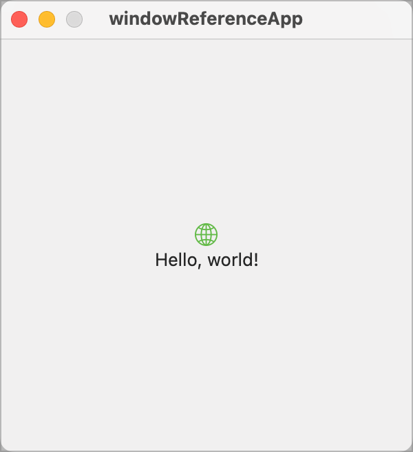
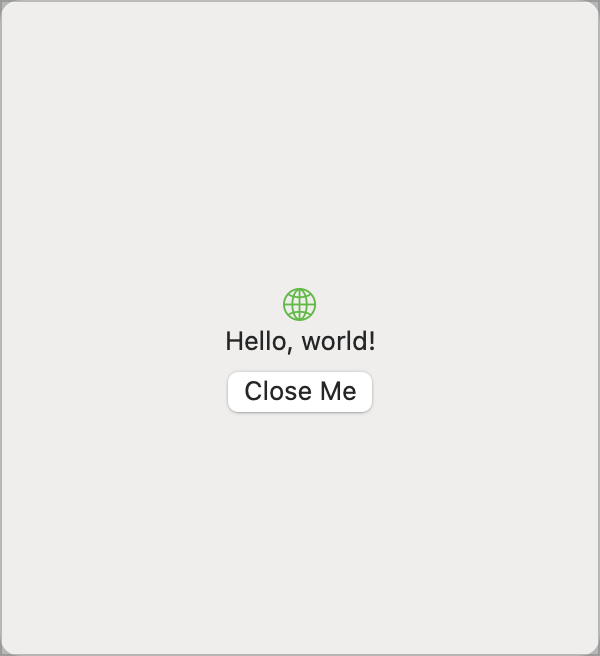

When I started trying to write a Mac app for the first time, I started out knowing what I wanted to achieve but not knowing how to go about it. I spent a lot of time googling for Mac development help and found very little of it. What i did find was mostly related to Objective-C and not Swift/SwiftUI.

So, I spent a lot of time going round in circles, extracting the bits that I thought relevant and heading down a lot of blind alleys.

This project is part of a series of development notes I want to write to document some of the stuff I learnt along the way. The note that goes with it can be found on my web site.

 [Referencing your NSWindow instance Article](http://www.sabarnett.co.uk/blogPage.php?id=nsWindow)

Out of the box, you can do a lot with SwiftUI and can create some stunning user interfaces. However, some things are not yet possible and you have to drop back to AppKit to achieve what you want. In this note, I deal with the mechanism that allows you to get access to the underlieing NSWindow so you can customise the attributes of your window, taking a basic window

to a heavily customised window

We have removed the standard window chrome to make a 'tool' window.

